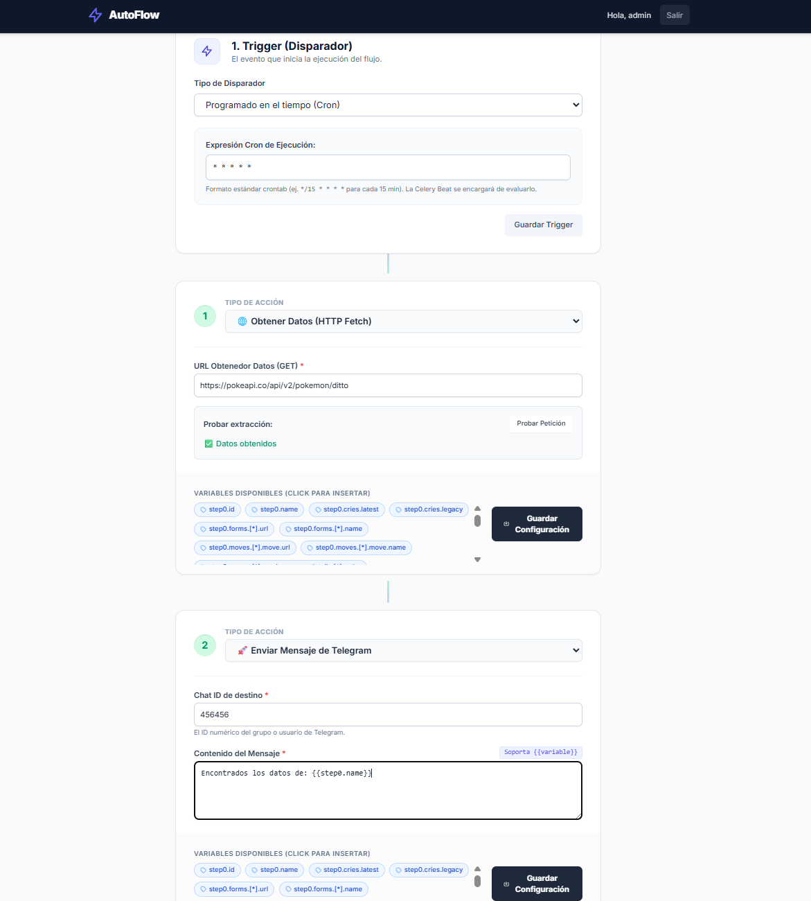

# ⚡ AutoFlow - No-Code Automation Engine

AutoFlow es una plataforma SaaS orientada a eventos que permite diseñar y ejecutar flujos de trabajo automatizados sin escribir código (estilo Zapier o Make). 

Este proyecto demuestra la implementación de una **arquitectura distribuida y asíncrona**, capaz de ingerir datos desconocidos (Webhooks), aplanarlos dinámicamente y ejecutar tareas programadas (Crons) interactuando con APIs externas.

---

## ✨ Características Principales

- **Ingesta Agnóstica (Webhook Receiver):** Endpoint optimizado que recibe payloads JSON dinámicos, responde en milisegundos (HTTP 202) y delega el procesamiento pesado a *background workers*.
- **Workflow Builder Visual:** Interfaz "Drag & Drop" simulada construida sin frameworks SPA pesados. Utiliza **HTMX** para interactividad asíncrona y **Alpine.js** para la inyección reactiva de variables en el frontend.
- **Introspección de Esquemas (JSON Flattening):** Sistema que analiza payloads de prueba de APIs externas, aplana la estructura de datos y genera "píldoras" visuales clicables para mapear rutas de datos (ej. `{{cliente.perfil.nombre}}`).
- **Ejecución Proactiva:** Integración con Celery Beat para flujos basados en expresiones CRON (ej. "Todos los viernes a las 17:00").

---

## 🏗 Arquitectura del Sistema

El proyecto está diseñado como un monolito modular con separación estricta de responsabilidades:
1. `workflows`: Aplicación frontend y gestión de configuración en base de datos.
2. `engine`: Motor de procesamiento asíncrono, flattening de JSON y parser dinámico.
3. `integrations`: Capa de servicios aislada para la comunicación con APIs externas (Telegram, SMTP, etc.).
